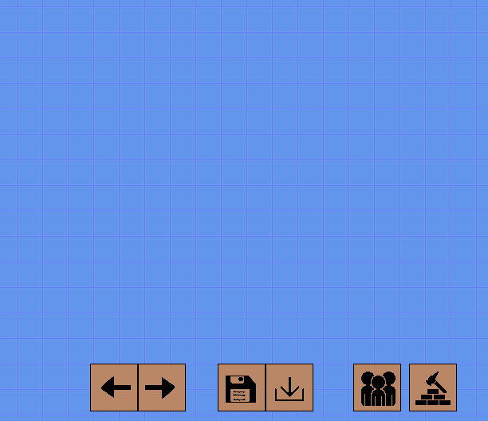

# kingsbetweenrivers
A 2d game currently implementing rudimentary A* algorithm pathfinding, a matrix controlled pan/zoom camera. 
Basic UI to create, delete, save and load structures to the game as well as create ai units. 

Waypoints can be given to ai units and they will pathfind to the user selected destination.
